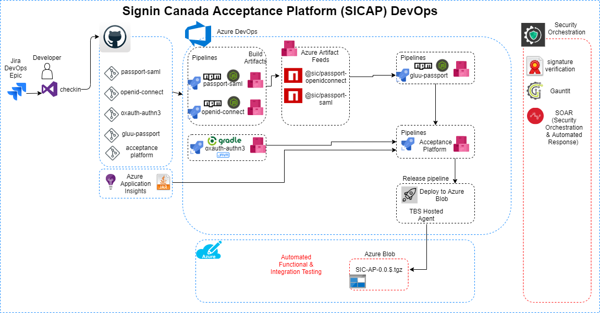

## Signin Canada DevOps Pipelines
Signin Canada Acceptance Platform (SICAP) is the combination of multiple open source code streams and some of these code streams have customization on top of it. All these code streams sit in their respective Github repos are are of varied programming languages which requires building and packaging which is then consumed by Acceptance Platform. SICAP not only consumes these packages but it had to do numerous other manual operations to reach end/desired state. For example these packages has to be in a specified directory structure and few other shell commands need to be executed in order for the installation to be successful. 

### Why Azure DevOps 
We started of by utilizing Azure DevOps Pipeline for automating SICAP packaging requirements. Reason for selection of Azure DevOps over any other technology was because it was already adopted by other teams within the organization and Azure public cloud was already chosen for infrastructure and datacenter extension which made Azure DevOps natural choice. Besides being already adopted by other teams Azure DevOps ecosystem was more integrated with the Azure public cloud and easy to adopt and develop our pipelines. 

Another major decision for choosing Azure DevOps was the SaaS offering with free non parallel jobs. This helped us fast track our CICD journey. 

## SICAP Pipelines 
So far only Continuous Integration has been put in place. Continuous deployment is yet to be done. More work required to be done on the IMTD side. 

### Build Pipeline
SICAP is based on [Gluu Server](https://www.gluu.org/) an open source IAM solution. SICAP team has customized below libraries  of Gluu:

- [Passport SAML](https://github.com/sign-in-canada/passport-saml)
- [Passport OpenIDConnect](https://github.com/sign-in-canada/passport-openidconnect)

The above two libraries are consumed by:

- [Gluu Passport](https://github.com/sign-in-canada/gluu-passport)

Shibboleth IDP external authentication plugin that delegates the authentication to an external Central Authentication Server. 
- [Shiboleth oxAuth Authn3](https://github.com/sign-in-canada/shib-oxauth-authn3)

All of the above libraries are then packaged into 

- [Acceptance Platform](https://github.com/sign-in-canada/Acceptance-Platform)

All of the above is graphically explained in below image. 

The source code for the above image is [here](Signin-pipeline.xml). Upload this file to [draw.io](www.draw.io) to modify the image. 

### Release pipeline
Once the above pipelines are built they produce a package which is then picked up by the Release pipeline to be published to an Azure blob. The Release pipeline is being run by TBS Hosted Agent which has access to the Azure blob. 

