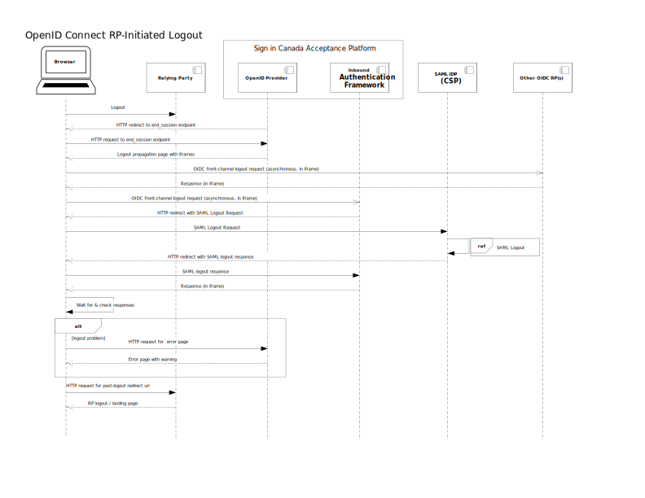
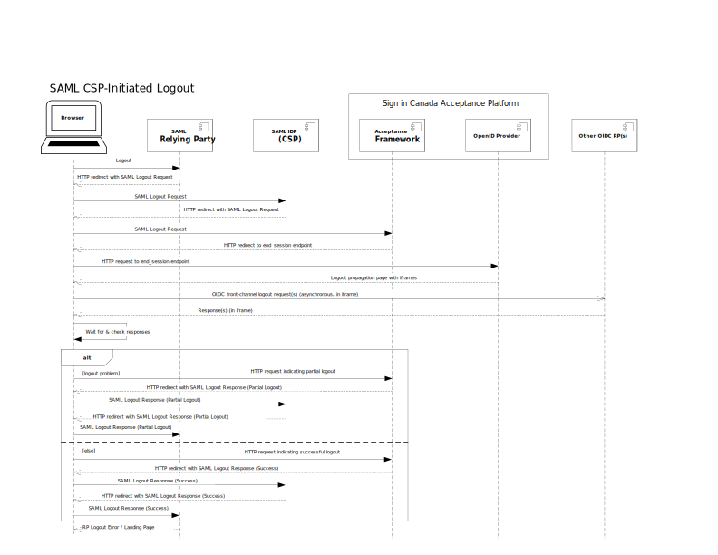

# Session Management

The Sign in Canada Acceptance Platform functions as a session management
authority that centrally coordinates users’ sessions across multiple RP
applications. There are two key features of the platform that support this:
single sign-on, and single logout.

## Single Sign-On

Once a user has successfully used a given credential or trusted digital identity
service to authenticate to one RP, the Acceptance Platform can allow them to
silently authenticate to other RPs subject to a 20 minute timeout period. The
Acceptance Platform accomplishes this by creating its own session with the user
when they first sign in to one RP, and then simply not prompting them when they
sign in to other RPs within the timeout window.

Relying parties who wish to force their users to authenticate every time can
still do so, using a parameter in their authentication requests.

_Note that in order for single sign-on to work, a user must use the same
credential or trusted digital identity to access all digital government
services. At present, this not possible since not all Government of Canada
services accept the same credentials. For example, accessing online tax services
provided by CRA is currently not possible using a CKey credential, therefore
users who chose to use a GCKey credential cannot single sign-on to CRA's "My
Account for Individuals"._

## Single Logout

When a user has used Sign in Canada to obtain multiple services provided by
multiple web sites (RP applications), the Acceptance Platform has the ability to
centrally coordinate single logout. With single logout, the user only has to
click one logout button on the site they are currently visiting, and the
Acceptance platform will then log them out of all the other sites they have
visited during their session.

The propagation of logout across all of these sites uses the [OpenID Connect
Front-Channel
Logout](https://openid.net/specs/openid-connect-frontchannel-1_0.html)
mechanism, the [SAML Single Logout
Profile](https://www.oasis-open.org/committees/download.php/56782/sstc-saml-profiles-errata-2.0-wd-07.html)
or both.

_Note: Support for the [OpenID Connect Back-Channel Logout](https://openid.net/specs/openid-connect-frontchannel-1_0.html) mechanism is planned for the future._

Both the OpenID Connect and SAML protocols follow the same basic sequence of events:

1. As a user leverages Sign in Canada to visit multiple web sites (applications)
   within the same session, the Acceptance Platform keeps track of which sites
   they have visited.
2. When the user clicks a logout button on one of the the sites they are
   visiting, that site's web application sends a logout request to the
   Acceptance Platform.
3. The Acceptance Platform then sends a logout request to all of the other sites
   the user has visited, so they can log the user out.

For those sites that support the SAML profile, each site that receives a SAML
logout request from the Acceptance Platform returns a SAML response to indicate
whether the user was successfully logged out. For those sites that use OpenID
Connect Front-Channel Logout, there is no similar response returned.

## Transition and Coexistence

There will be an extended transition period as RP applications connect to the
Acceptance Platform and disconnect from the legacy GCKey and Credential Broker
services one at a time. During this transition period, the Acceptance Platform
will serve as the session management authority for applications connected to it,
while the GCKey and Credential Broker services serve as the session management
authority for applications connected to them.

This creates a requirement for the Acceptance Platform to coordinate single
logout with GCKey and CBS, as well as with its own RPs. The Acceptance Platform
accomplishes this by supporting the SAML Single Logout profile as part of its
integration, as a relying party, with GCKey and CBS.

The following example scenario illustrates how single logout is achieved in the
case where the user clicks a logout button on a relying party site that is connected to the
Acceptance Platform.

The scenario begins when a user clicks a logout button on the relying party site
they have been using. When this happens:

1. The relying party application logs the user out locally first, then it redirects the browser to the Acceptance Platforms's end_session endpoint.
2. The Acceptance Platform returns an
   [HTML](https://html.spec.whatwg.org/multipage/) logout propagation page. This
   page contains a number of
   [iframe](https://html.spec.whatwg.org/multipage/iframe-embed-object.html#the-iframe-element)
   elements. The `src` (source) attribute of all but one of the `iframe`
   elements points to the [URI](https://tools.ietf.org/html/rfc3986) of another
   relying party site where the user has logged in during their current session.
   In the diagram, these other sites are identified as "Other OIDC RPs". The
   `src` attribute of the final `iframe` points to a URI endpoint of the
   Acceptance Platform's Acceptance Framework.
3. Upon receiving the propagation page, the browser begins to load all of the of
   the `iframe`s in parallel, by asynchronously sending an HTTP GET request to
   the `src` URI of each `iframe`.
4. As the other relying parties receive these requests, they log the user out
   locally, and then return an HTTP response to the browser.
5. When the Acceptance Platform's Acceptance Framework receives its request, it
   creates a SAML `LogoutRequest` message and then redirects the browser with
   that message (within the `iframe`) to the legacy CSP (GCKey or CBS) that the
   user chose to log in with.
6. The CSP then logs the user out of their credential. If the user has visited
   any sites that are still connected directly to the CSP (instead of to Sign in
   Canada) it will also propagate the logout to all of those sites.
7. The CSP then redirects the browser (within the `iframe`) back to the
   Acceptance Platform's Acceptance Framework with a SAML
   `LogoutResponse` message. The Acceptance Framework processes this
   message and then sends an HTTP response back to the browser.
8. While all of the `iframe`s are propagating the logout to various sites
   asynchronously, their progress is monitored by JavaScript code running in the
   browser. Once all of the `iframes` have completely loaded, this JavaScript
   code checks the success or failure status of each.
9. If any of the `iframes` fail or time-out, the JavaScript code will redirect
   the browser to an error page, warning the user that they may not be
   completely signed out and recommending that they close their browser.
10. If all of the `iframes` successfully propagate logout to their target site,
    then the browser is redirected to the logout landing page of the site where
    the user initially clicked "Logout".

The next example scenario illustrates how single logout is achieved in the case
where the user clicks a logout button on a relying party site that is still
connected one of the GCCF credential services (GCKey or CBS).

The scenario begins when a user clicks a logout button on the relying party site
they have been using. When this happens:

1. The relying party application logs the user out locally first, then it
   redirects the browser to the CSP's SAML Single Logout endpoint with a SAML
   `LogoutRequest` message.
2. The CSP then redirect the browser to the Acceptance Platform's Acceptance
   Framework with a SAML `LogoutRequest` message.
3. The Acceptance framework then redirect the browser to the Acceptance
   Platform's OpenID Provider (OP)'s end_session endpoint.
4. The Acceptance Platform returns an
   [HTML](https://html.spec.whatwg.org/multipage/) logout propagation page. This
   page contains a number of
   [iframe](https://html.spec.whatwg.org/multipage/iframe-embed-object.html#the-iframe-element)
   elements. The `src` (source) attribute of all but one of the `iframe`
   elements points to the [URI](https://tools.ietf.org/html/rfc3986) of another
   relying party site where the user has logged in during their current session.
   In the diagram, these other sites are identified as "Other OIDC RPs". The
   `src` attribute of the final `iframe` points to a URI endpoint of the
   Acceptance Platform's Acceptance Framework.
5. Upon receiving the propagation page, the browser begins to load all of the of
   the `iframe`s in parallel, by asynchronously sending an HTTP GET request to
   the `src` URI of each `iframe`.
6. As the other relying parties receive these requests, they log the user out
   locally, and then return an HTTP response to the browser.
7. While all of the `iframe`s are propagating the logout to various sites
   asynchronously, their progress is monitored by JavaScript code running in the
   browser. Once all of the `iframes` have completely loaded, this JavaScript
   code checks the success or failure status of each.
8. If any of the `iframes` fail or time-out, the JavaScript code will redirect
   the browser to the Acceptance Framework with an HTTP request that indicates a
   logout problem.
    1. The Acceptance Framework will then redirect the browser back
   to the CSP with a SAML `LogoutResponse` message bearing a status code of
   `urn:oasis:names:tc:SAML:2.0:status:Responder`.
    2. The CSP will then in turn redirect the browser back to it's own RP with a
      `LogoutResponse` message bearing a top level status code of
      `urn:oasis:names:tc:SAML:2.0:status:Success` and a second-level status
      code of `urn:oasis:names:tc:SAML:2.0:status:PartialLogout`.
    3. This will cause the SAML RP to display error page, warning the user that
       they may not be completely signed out and recommending that they close
       their browser.
9. If all of the `iframes` successfully propagate logout to their target site,
    the JavaScript code will redirect the browser to the Acceptance Framework
    with an HTTP request that indicates a successful logout.
    1. The Acceptance Framework will then redirect the browser back to the CSP
       with a SAML `LogoutResponse` message bearing a status code of
       `urn:oasis:names:tc:SAML:2.0:status:Success`.
    2. The CSP will then in turn redirect the browser back to it's own RP with a
       `LogoutResponse` message bearing a top level status code of
       `urn:oasis:names:tc:SAML:2.0:status:Success` and no  second-level status
       code.
    3. This will cause the SAML RP to their usual logout or landing page.
