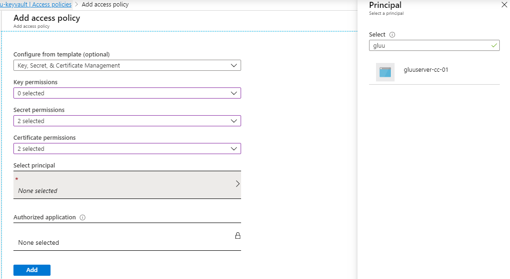

## Setting up Environment for Signin Canada (SIC)
Signin Canada Acceptance Platform application is using open source [Gluu server](https://www.gluu.org/) to provide the SAML and OIDC based authentication framework. In order to test the Acceptance Platform a Gluu server needs to be installed on RHEL7 or CentOS7 with [Couchbase Database](https://www.couchbase.com/). Ideally DB needs to be installed on a seperate VM if not then this can be installed locally but that will require a beefy VM. 

### VM Requirements
- RHEL7 or CentOS7 
- 16GB RAM 
- 2 CPUs
- 100 GB HDD if installing local database

### VM Setup Requirements 
To setup the VM and make it ready for Gluu server installation following changes need to be made
Most of the below steps are written in the [attached script](install-gluu.sh) but quiet a few variables need to be changed according to the environment. 

- Hostname needs to be setup
- /etc/hosts file must have the local IP address and hostname resolvable
- Install the gluu server rpm specific version from [gluu repo](https://repo.gluu.org/#)
- Once the above changes are done then the Acceptance Platform Tarball needs to be copied over to the VM and untarred. 

For full details on [Gluu installation instructions](https://gluu.org/docs/ce/installation-guide/install-centos/)

### Optional local couchbase install
- If the plan is to [install local couchbase DB](https://gluu.org/docs/cb/4.0/) then it has to be downloaded to below mentioned location. The couchbase folder needs to be created manually.
```
opt/gluu-server/opt/dist/couchbase 
```
- For [remote couchbase installation](https://gluu.org/docs/cb/4.0/#remote-installation) run ``` setup.py --remote-couchbase ```

### Copy SIC Tarball to Gluu Container Directory
SIC Acceptance Platform currently gets packaged in a tarball through a Azure DevOps pipeline and it gets copied to Azure Blob, these are not accessible outside of corporate network. Below is test location that one of the team member is using for testing in outside of corporate location. It is important to download and untar the SIC Tarball to the gluu container directory in order to get the full functionality: 
``` 
$ wget https://***.blob.core.windows.net/staging/SIC-AP-0.0.31.tgz
$ tar -C /opt/gluu-server/ -xvf SIC-AP-0.0.31.tgz
```

### Gluu Setup (manual steps from here onwards)
Next step is to run setup.py file from within gluu container install the Gluu server. Remember this setup is different from installing the rpm mentioned in the [VM Setup Requirement](#VM-Setup-Requirements) section above. 

``` shell
$ /sbin/gluu-serverd enable
$ /sbin/gluu-serverd start
$ /sbin/gluu-serverd login
$ cd /install/community-edition-setup/
$ ./setup.py -sp
```
The [setup.py](https://gluu.org/docs/ce/3.0.2/installation-guide/install/#run-setuppy) file starts to deploy the Gluu server and user input is required for the prompts. Follow the prompts on the screen to finish the setup. 
```note
To install local couchbase select option 3 below
Install (1) Gluu OpenDj (2) Couchbase (3) Hybrid [1|2|3]
```
This should give you the default installation of the Gluu Server and normal [user guide](https://gluu.org/docs/ce/3.0.2/admin-guide/oxtrust-ui/) instructions can be followed. Rest of the steps are required to setup SIC platform. 

### Certificates in Azure Keyvault and VM Access
In order to integrate and talk to the credential broker service (CBS) and Relying Party simulator proper certificates need to be setup in the system. SIC Acceptance platform out of the box is integrated with Azure Keyvault and it is a good idea to upload the provided certificates (from the SIC team) to Azure Keyvault and allow the VM Managed Identity access to the keyvault. 

Following certificates must be imported into keyvault:


To allow Gluu Server access the keyvault it is important to set the System Managed Identity permissions on the keyvaul. These steps can be looked up in official Azure documentation but for reference below are few images. 




### Setting up certificates on Gluu Server 

## Let's Encrypt Certificate with Certbot
The Gluu Server is a web application which requires a valid certificate for communication. We can get a certificated from Let's Encrypt and use certbot to install it on the Gluu Server. Below are some instructions to do that
```shell
 $ /sbin/gluu-serverd login 
 Welcome to the Gluu Server!
 $ yum install -y certbot
 $ vi /etc/httpd/conf.d/https_gluu.conf
```
Comment the redirect line to stop gluu redirection. So that certbot/letsencrypt can verify the cert location
```
<VirtualHost  *:80>
        ServerName gluuserver-cc-01.canadacentral.cloudapp.azure.com
        Redirect  / https://gluuserver-cc-01.canadacentral.cloudapp.azure.com/
        DocumentRoot "/var/www/html/"
</VirtualHost>
```
Once the above change is done then run below certbot command to install certificate. 
```
 $ service httpd restart
 $ certbot certonly --webroot -w /var/www/html/ -d gluuserver-cc-01.canadacentral.cloudapp.azure.com
```
We have to revert the change made to ``` /etc/httpd/conf.d/https_gluu.conf ``` after the cert verification is done and re-enable Gluu redirection. 

#### Next step 
Copy the httpd certificate privatekey and fullchain.pem and import it into Keyvault. Following commands need to be exectuted:
```
$ cd /etc/letsencrypt/live/gluuserver-cc-01.canadacentral.cloudapp.azure.com/
$ cat fullchain.pem privkey.pem > new.pem
$ vi new.pem
```
#### Next Step
Run below postinstall.sh script and modify the keyvault. url in the azure script to copy over all certificates to the Gluu Server. 
```
$ /opt/dist/signincanada/postinstall.sh
$ vi /etc/default/azure
--- you can check if the certificates have been copied -----
$ find /run/keyvault/ -print
$ ll /etc/certs/
$ ps -ef --forest
------ Exit out of the container ------
exit 
```
Restart the Gluu container 
```
$ /sbin/gluu-serverd restart
```
