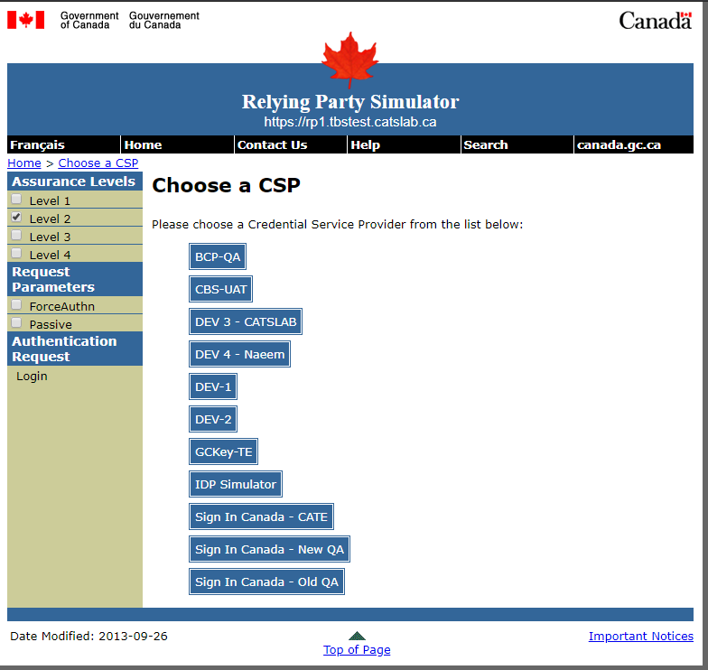

## Testing Signin Canada (SIC)
To test Signin Canada Acceptance Platform application it is important to have or setup the [environment](../environment/README.md). Usually these envrionments are already available and provided but if in an unforseeable circumstances you have to create one, instructions are available [here](../environment/README.md). 

### Test Suite 

### Web based Manual Test Flows

```
https://rp1.tbstest.catslab.ca/RPSimulator/
```

```
https://rp1.tbstest.catslab.ca/RPSimulator/home-eng.jsp
```

```
https://rp1.tbstest.catslab.ca/RPSimulator/setReq
```
Set the Level of Assurance to 2
```
https://rp1.tbstest.catslab.ca/RPSimulator/choose-eng.jsp
```


```
https://gluuserver-cc-01.canadacentral.cloudapp.azure.com/oxauth/select.htm
```


```
https://cpsim1.catslab.ca/openam/SSORedirect/metaAlias/idp?SAMLRequest=nVPBjtowFPyVyPfEAboEWcCKgqoibbuI0B56qR4vD9Zax3ZtZwv9%2BjoBWg4tB06R%2FMZvxjOT8eOhVskbOS%2BNnrBelrPH6dhDrayYNeFFr%2BlHQz4kEaa96AYT1jgtDHjphYaavAgoytmnJ9HPcmGdCQaNYslyMWHfC9oh0giK4UO%2FqAqoihGw5OuFMN6IQO8bWmofQId4lPfzNB%2BkvdGmNxTvhmJQZIPhwzeWrM6r30tdSb2%2FrWN7AnnxcbNZpavncsOSRXyJ1BA66pcQrBeco%2FWy7mUIwSvYxi83luI%2BXpbPa6qkIwy8pgAzJcFzWVmWfDAOqfNnwoJriCUz78m1i%2BdG%2B6YmV5J7k0hf1k9%2FqfaqaSIs2p0ipnlLqqECJB0cqAyVaSqwNoNfjaMMTc0teG%2BNCxwiGW%2Ft53t8pSNHUGoL%2BMpOaYnOQ3cV02134CKXTe8WN%2BZXzJfSfI5Uy8XKKInHe0oTna0h3Ea3J7JKdx1U2LZLPkSZMQWlzM%2B5Iwh0DoZfhJ2LTFUXW0wp0OGuWs9NbcFJ33aIDoDhEsH14rmKDq9pd08gLWyPKYLA4zam0UbfzhsHGkkoA%2F2z9f9inJ5m%2F3nwn%2Bn1zz39DQ%3D%3D&SigAlg=http%3A%2F%2Fwww.w3.org%2F2001%2F04%2Fxmldsig-more%23rsa-sha256&Signature=eai2xd5akdaygd35tAnvx5%2Fp48xtsKE14R5owTk3VNFzmPbr1ghRfrNRSxBF067g07w8cQz5oDBUGOpvdP1OqzDC%2BJNwTPL8wunP%2BuZ%2BngfnhOrDWBytbiTtauvQh8JLRVGMbPe754vNqII2ywpKWOeCmwVx5kxuIU4pYx1h7QhlZPwOoUoaZunS%2F3OLx9tmPXl0XsmOuANB3r8RAn%2BSQ7k3WyHfzRwAaLjBtNt9ttCmUEVoDTZfKZpx2ReuFlKXYypTXd1mK3I0WI1k8FJwRulqKEelxh%2FioDmh5%2BoReNUzao8YDBu9FnrcIFI1ForMXM4OoQwdQ2VH0WDP0BIzFQ%3D%3D
```


```
https://rp1.tbstest.catslab.ca/RPSimulator/response-eng.jsp?_saml_idp=aHR0cHM6Ly9jcHNpbTEuY2F0c2xhYi5jYQ%253D%253D
```


### Gluu Builtin oxAuth RP 
Once the Gluu Server is up and running and if the buit-in oxAuth RP is installed with -sp switch. The builtin oxAuth Relying party simulator is a good way to start testing the flows. 
```
https://gluuserver-cc-01.canadacentral.cloudapp.azure.com/oxauth-rp/home.htm
```


## Automated Tests
### Performance Tests (JMeter)
[Sample JMeter tests](https://github.com/GluuFederation/oxAuth/tree/master/jmeter/test) from Gluu Federation 
